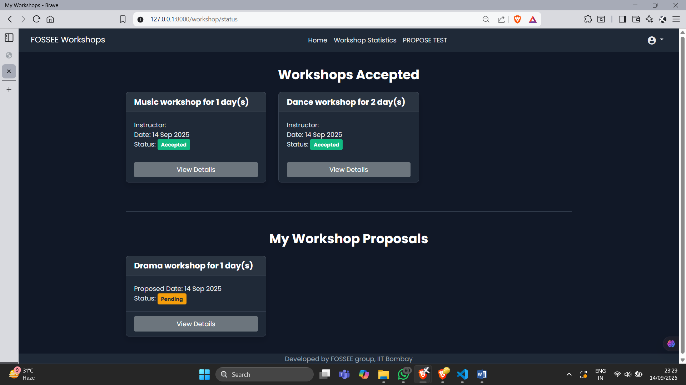
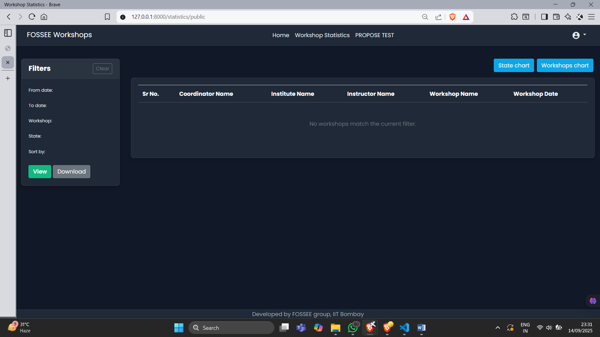
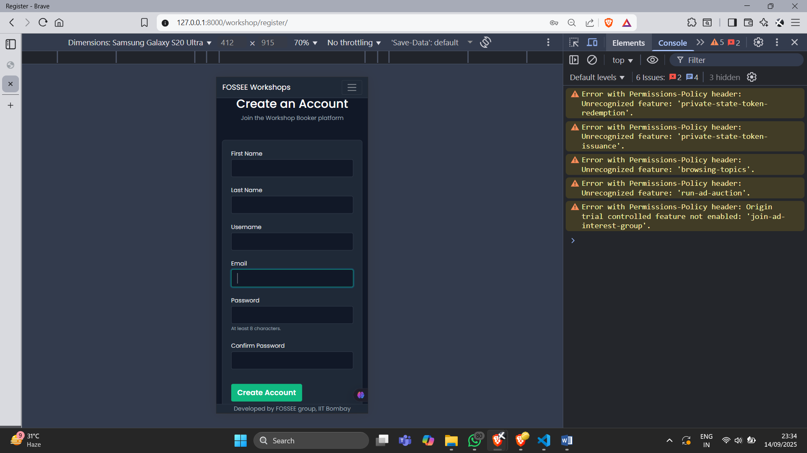
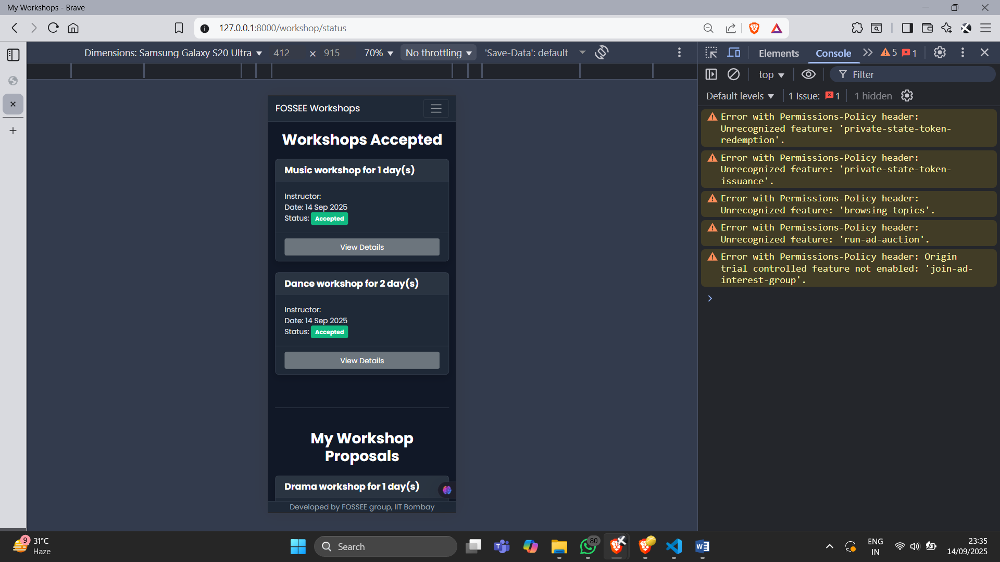
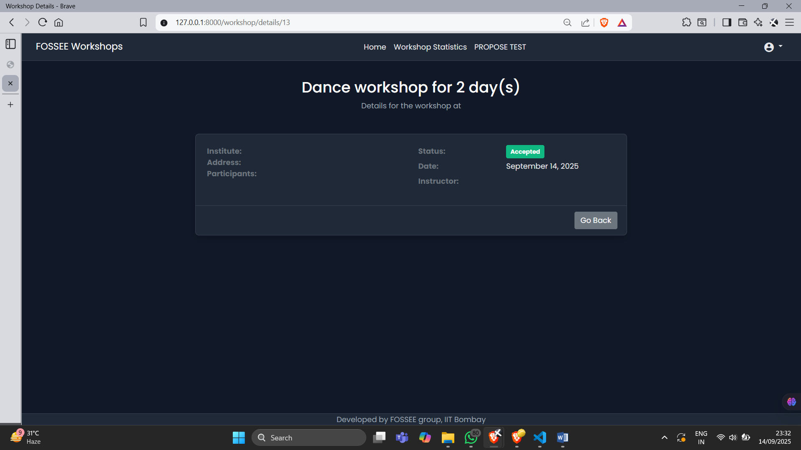
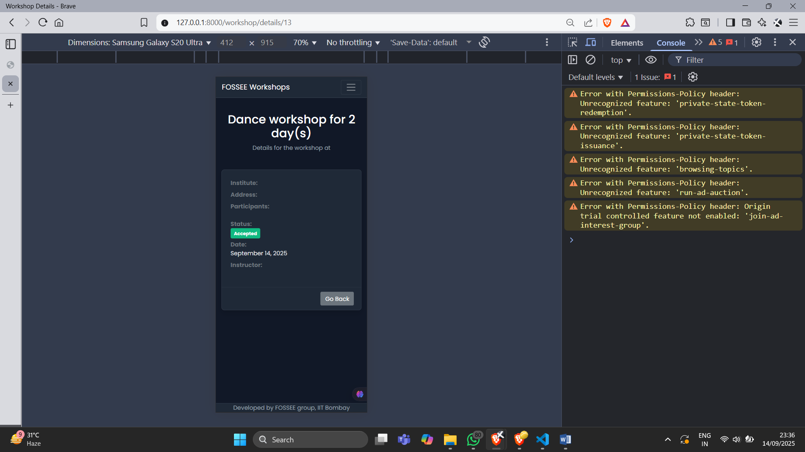

# UI/UX Enhancement for FOSSEE Workshop Booker

This project is a submission for the Python Screening Task. The goal was to take the existing Django-based workshop booking website and improve its user interface and user experience, with a primary focus on mobile responsiveness.

repo: https://github.com/FOSSEE/workshop_booking

---

## Setup and Installation

To run this project locally, please follow these steps:

1.  **Clone the repository:**
    ```bash
    git clone [https://github.com/Yash0951/Task1.git](https://github.com/Yash0951/Task1.git)
    cd Task1
    ```

2.  **Create and activate a virtual environment:**
    ```bash
    # For Windows
    python -m venv env
    .\env\Scripts\activate
    ```

3.  **Install dependencies:**
    ```bash
    pip install -r requirements.txt
    pip install setuptools
    ```

4.  **Set up the database:**
    ```bash
    python manage.py makemigrations
    python manage.py migrate
    ```

5.  **Create an admin user:**
    ```bash
    python manage.py createsuperuser
    ```
    *(Follow the prompts to create your admin user)*

6.  **IMPORTANT: Create the user's profile:**
    * Start the server: `python manage.py runserver`
    * Go to the admin panel in your browser: `http://127.0.0.1:8000/admin/`
    * Log in with the admin user you just created.
    * On the admin dashboard, find "Profiles" and click **"+ Add"**.
    * Select your username from the "User" dropdown, fill in any other required details, and click **SAVE**.

7.  **Run the server (for normal use):**
    ```bash
    python manage.py runserver
    ```
    You can now log into the main site at `http://127.0.0.1:8000/workshop/login/`

--


<!-- ## Visual Showcase: Before and After

Here are screenshots demonstrating the UI/UX improvements, particularly in mobile view.

| Before | 


| improved | 


| new |
 


| mobile view/ responsive|


--- -->

<!-- ## Visual Showcase: Before and After

Here are screenshots demonstrating the UI/UX improvements, particularly in mobile view.

### Key Page Improvements

| Before | After |
| :---: | :---: |
|  |  |
| *Original landing page.* | *New landing page with a clean, modern design.* |
|  |  |
| *Original, non-responsive login form.* | *New, responsive login form with a professional layout.* |
|  |  |
| *Original statistics page with a rigid table.* | *New statistics page with improved filters and layout.* |


### Mobile Responsive View

Here is how the new design adapts to a mobile screen size.

| Login & Register | Workshop Status | Details |
| :---: | :---: | :---: |
|  |  |  | -->

## Visual Showcase: Before and After

Here are screenshots demonstrating the UI/UX improvements, particularly in mobile view.

### Before
These images show the original, non-responsive design of the website.


---
### Improved Design
These images show the final, clean, and responsive design of the key pages.




---
### Mobile Responsive View
Here is how the new design adapts to various mobile screen sizes.




## Reasoning and Design Principles

#### What design principles guided your improvements?

* **Mobile-First Design:** The primary goal was to ensure the interface was clean, readable, and fully functional on small screens. The design was approached from a mobile perspective first.
* **Clarity and Simplicity:** The old, dense tables were replaced with a clean, card-based layout. Whitespace and a clear visual hierarchy were used to reduce clutter and guide the user.
* **Consistency:** A unified color palette and typography were established in a central `custom.css` file. This ensures that all components—navbars, buttons, cards, footers—share a single, professional design language.

#### How did you ensure responsiveness across devices?

* **Bootstrap's Grid System:** The core of the responsiveness relies on Bootstrap's `flexbox`-based grid (`.row`, `.col-lg-4`, etc.). This allows the card layout to automatically reflow from multiple columns on a desktop to a single column on a mobile device.
* **Responsive Components:** Standard Bootstrap components were used, most notably the `navbar`, which now collapses into a hamburger menu on mobile, and `form-control` classes that ensure form inputs stretch to 100% width on phones.
* **Fluid Containers:** Using `.container-fluid` in the navbar and `.container` for content ensures that the layout uses screen space effectively while preventing horizontal overflow.

#### What trade-offs did you make between the design and performance?

* **Framework vs. Pure CSS:** I used the Bootstrap framework to ensure a reliable and fast development cycle. The trade-off is a slightly larger initial file size compared to writing minimal, custom CSS from scratch, but the benefit is robust, pre-tested components.
* **Readability vs. Animations:** The design prioritizes fast load times and a clean, readable interface over complex JavaScript animations, which could harm performance on less powerful mobile devices.

#### What was the most challenging part of the task and how did you approach it?

The most challenging part was integrating the modern Bootstrap form styling with Django's template rendering. Django's default `{{ form.as_p }}` tags don't allow for the necessary CSS classes. The solution was to manually render each form field in the HTML templates (`login.html`, `register.html`, etc.). This provided complete control over the markup, allowing me to add the required Bootstrap classes like `.form-control` and achieve a clean, consistent, and fully responsive design for all forms.